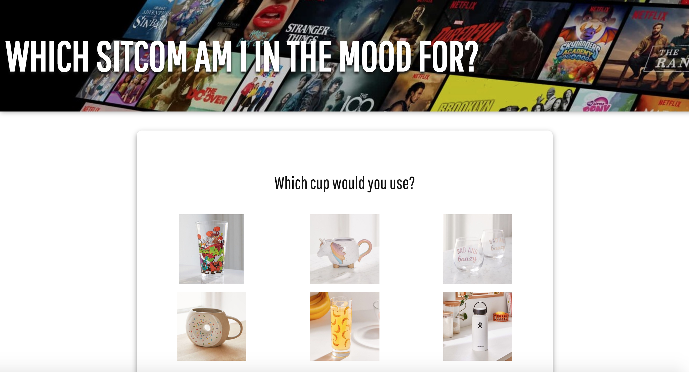

# Lab 2 - Buzzfeed Quiz

## Assignment
For this assignment, I created a buzzfeed-style quiz to determine which sitcom you are in the mood to watch. I took styling inspiration from Netflix's website (i.e. tall blocky font, white text over background image) and have six possible outcomes linked to the six different answer responses. The hosted quiz can be found [here](https://dartmouth-cs52-19s.github.io/lab2-emmalangfitt/).

  

## Structure
An HTML outline of the site is kept in `index.html`, and the rest of the html is inserted by `main.js` based on the data found in a specified JSON file. To build a different quiz, change the file path in line 74 of `main.js` to point to the JSON file of your desired data. 

The JavaScript assumes that the JSON files includes a title, a pathway to a background image, an array of outcomes that each contain an image and a text result, and an array of questions that each contain a question name and either text answers or image answers. The CSS styling will look best if there are six possible responses for each question correlating with six possible quiz outcomes. 

## Results
I included JSON files to create two different quizzes. The first is a more extensive eight-question quiz to determine which sitcom you are in the mood to watch, and the second is a short three-question quiz to see which day of the week you are. To switch between the quizzes, change line 74 of `main.js` from `data_sitcoms.JSON` to `data_weekdays.JSON`.

Each quiz is styled with four possible answer states (none selected, hover, selected, and non-selected) and the result is shown in a modal that fades in and out of view with some animated text. If the user has not finished each question, clicking the "done" button will show a message telling the user to complete the rest of the questions.

If I were to revisit this project, I'd try to perfect the mobile display. The quiz works on mobile and the formatting isn't bad, but I think I could find a cleaner way to resize the question modules so that the options are more readable. 
